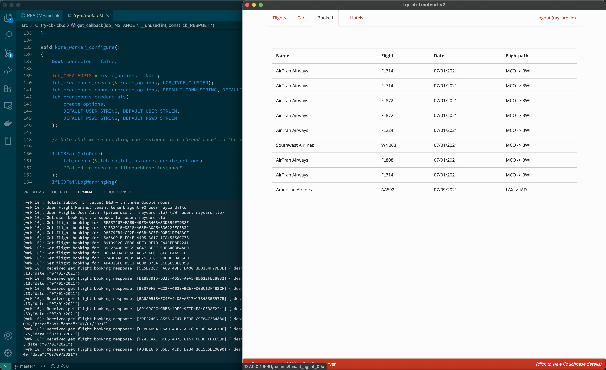

# Couchbase LCB travel-sample Application REST Backend

This is a sample application for getting started with [Couchbase Server] and the [C-SDK] (aka, **libcouchbase**, **LCB**).
The application runs a single page web UI for demonstrating [N1QL] (SQL for Documents), [Sub-Document] requests, and Full Text Search ([FTS]) querying capabilities.
It uses **Couchbase Server** together with the [Kore.io] web framework, [Swagger] for API documentation, [cJSON] for handling JSON serialization, and [libjwt] for the JWT Authorization token.

The application is a flight planner that allows the user to search for and select a flight route (including the return flight) based on airports and dates.
Airport selection is done dynamically using an autocomplete box bound to **N1QL** queries on the server side. After selecting a date, it then searches
for applicable air flight routes from a previously populated database. An additional page allows users to search for Hotels using less structured keywords.



## Prerequisites

To download the application you can either download [the archive](https://github.com/couchbaselabs/try-cb-lcb/archive/master.zip) or clone the repository:

```
git clone https://github.com/couchbaselabs/try-cb-lcb.git
```

We recommend running the application with Docker, which starts up all components for you, but you can also run it in a Mix-and-Match style, which we'll decribe below.

## Design Note

This sample is focused on demonstrating some of the basic concepts of working with the Couchbase [C-SDK] and does not represent best practices for writing a scalable production ready REST server. [Kore.io] has several features that can be used to implement strategies that scale much better (memory pools, async tasks, etc). However, this sample currently just implements a simple "thread per connection" model by using one LCB instance per thread, thread local memory, and `lcb_wait()` with synchronous callback delegates. A scalable production server would most likely want to use background tasks or events and asynchronous strategies instead.

## Running the application with Docker

You will need [Docker](https://docs.docker.com/get-docker/) installed on your machine in order to run this application as we have defined a [_Dockerfile_](Dockerfile) and a [_docker-compose.yml_](docker-compose.yml) to run Couchbase Server, the frontend [Vue app](https://github.com/couchbaselabs/try-cb-frontend-v2.git) and this C-SDK REST server.

To launch the full application you can simply run this command from a terminal:

```
docker-compose up
```

> **_NOTE:_** When you run the application for the first time, it will pull/build the relevant docker images, so it might take a bit of time.

This will start this backend REST server, Couchbase Server and the Vue frontend app.

You can access the backend API on `http://localhost:8080/`, the UI on `http://localhost:8081/` and Couchbase Server at `http://localhost:8091/`.

You should then be able to browse the UI, search for US airports and get flight route information.

In order to make changes and familiarize yourself more with the [C-SDK], you will need to run the server manually, update the source files, and use the `kodev` commands or the [`dev-run.sh`](dev-run.sh) helper.

To end the application press <kbd>Control</kbd>+<kbd>C</kbd> in the terminal and wait for docker-compose to gracefully stop your containers.

## Mix and match services

Instead of running all services, you can start any combination of `backend`,`frontend`, `db` via Docker, and take responsibility for starting the other services yourself.

As the provided [`docker-compose.yml`](docker-compose.yml) sets up dependencies between the services, to make startup as smooth and automatic as possible, we also provide an alternative [`mix-and-match.yml`](mix-and-match.yml).  We'll look at a few useful scenarios here.

### Bring your own database
If you wish to run this application against your own configuration of Couchbase Server, you will need version 7.0.0 beta or later with the `travel-sample` bucket setup.

> **_NOTE:_** If you are not using Docker to start up the Database, or the provided wrapper [`wait-for-couchbase.sh`](wait-for-couchbase.sh), you will need to create a full text search index on travel-sample bucket called 'hotels-index'. You can do this via the following command:

```
curl --fail -s -u <username>:<password> -X PUT \
        http://<host>:8094/api/index/hotels-index \
        -H 'cache-control: no-cache' \
        -H 'content-type: application/json' \
        -d @fts-hotels-index.json
```

With a running Couchbase Server, you can pass the database details in:

```
CB_HOST=10.144.211.101 CB_USER=Administrator CB_PSWD=password docker-compose -f mix-and-match.yml up backend frontend
```

The Docker image will run the same checks as usual, and also create the hotels-index if it does not already exist.

### Running the backend manually

If you want to run this backend REST server yourself without using Docker, you will need to ensure that you have the dependencies installed and are able to run the [Kore.io] run commands. You may still use Docker to run the Database and Frontend components if desired.

### Install the dependencies:

[Kore.io] supports several unix variants but it's easiest to get started on **macOS 10.10.x** or greater with [homebrew](https://brew.sh/) using the following command:

```
brew install libcouchbase kore cjson libjwt
```

The first time you run against a new database image, you may want to use the provided
[`wait-for-couchbase.sh`](wait-for-couchbase.sh) wrapper to ensure that all indexes are created.

For example, using the Docker image provided:

```
docker-compose -f mix-and-match.yml up db
export CB_HOST=localhost
./wait-for-couchbase.sh echo Couchbase is ready!
kodev -c localhost -u Administrator -p password
```

If you already have an existing Couchbase server running and correctly configured, you might run:

```
kodev -c 10.144.211.101 -u Administrator -p password
```

Finally, if you want to see how the sample frontend Vue application works with your changes,
run it with:

```
docker-compose -f mix-and-match.yml up frontend
```

### Running the frontend manually

To run the frontend components manually without Docker, follow the instructions in the
[front end repository](https://github.com/couchbaselabs/try-cb-frontend-v2).


## REST API reference

The Swagger/OpenApi version 3 documentation can be accessed on the backend at `http://localhost:8080/apidocs` or in the [assets directory](./assets).

[Couchbase Server]: https://www.couchbase.com/
[C-SDK]: https://docs.couchbase.com/c-sdk/current/hello-world/overview.html
[Sub-Document]: https://docs.couchbase.com/c-sdk/current/howtos/subdocument-operations.html
[N1QL]: https://docs.couchbase.com/c-sdk/current/howtos/n1ql-queries-with-sdk.html
[FTS]: https://docs.couchbase.com/c-sdk/current/howtos/full-text-searching-with-sdk.html
[Kore.io]: https://kore.io/
[cJSON]: https://github.com/DaveGamble/cJSON
[libjwt]: https://github.com/benmcollins/libjwt
[Swagger]: https://swagger.io/resources/open-api/